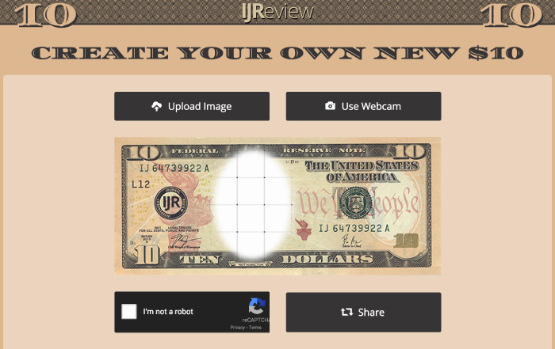
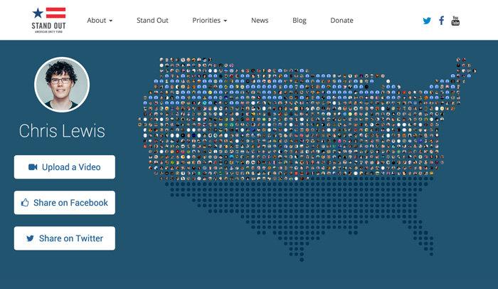
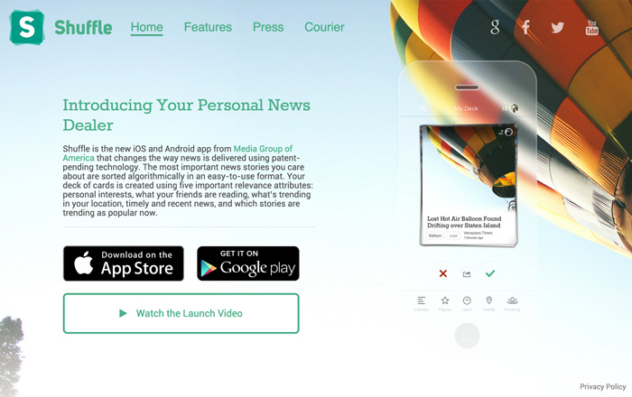
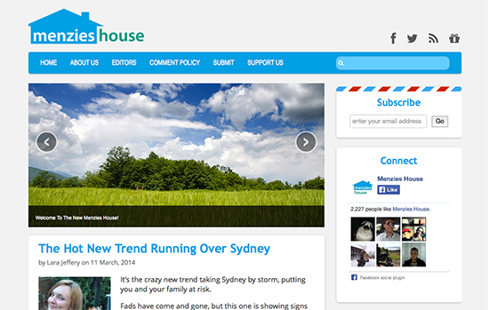
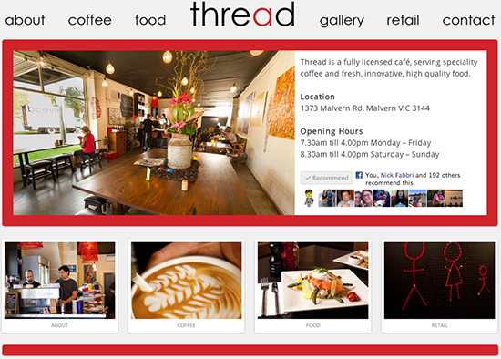
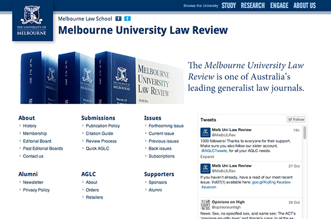
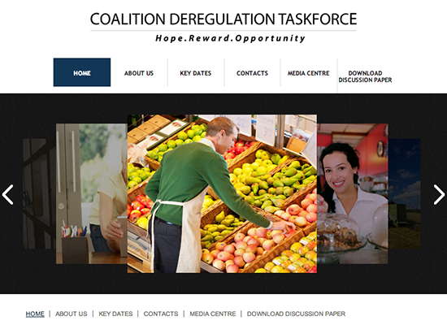
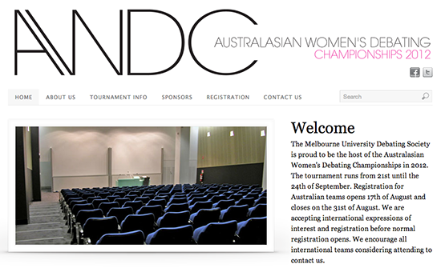

Whilst in Washington DC, I got to work on some cool stuff for [IJ](http://www.ij.com) and [IMGE](http://www.imge.com) (both entities of MGA).

*IJ is a social news company that serves millions of Americans daily with shareable, informative, and mobile friendly content.* 'Create Your Own $10' was in response to reports that a women would be featured on the new $10 bill. It runs on NodeJS/Express and uses Amazon S3 to store the images.

*IMGE does digital advocacy for a variety of corporate and political clients.* For the American Unity Fund's marriage equality campaign we build a map of America filled (dynamically) with the faces of those who had signed the petition (either from social media or through manual user upload). The map is created from ASCII art and is therefore completely customisable.

As part of the launch of Shuffle, IMGE Labs' social news App, we built a single page website to showcase some of its features. The website had some cool effects like animated transitions under a blurred image.

## Freelance Work

Menzies House is forum for policy discussion with an emphasis on classical liberalism. I was responsible for the current look, which was part of a broader relaunch in 2014. It uses a custom Wordpress theme with social media integration and was designed to accommodate high volumes of traffic.

Thread is a Malvern based speciality coffee shop. The website is still live and can be found. The site uses custom Wordpress theme, Facebook integration and high-res photography.

As the core layout and functionality was already provided by the University's CMS, work mainly involved adding content and modifying features as needed, e.g. Twitter feed.

Homepage for the 2011-12 Coalition Deregulation Taskforce. Uses a custom Wordpress theme and a plugin for handling submissions.

Homepage for the 2011 Australian Women's Debating Competition, which was being hosted by the Melbourne University Debating Society. Custom Wordpress theme.

