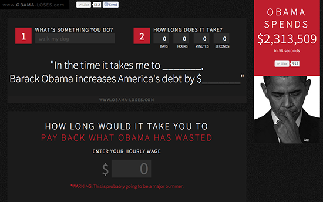



Over the years I’ve completed a number of programming projects, including web development, scraping and data-mining. A selection of public projects can be found bellow.

If you have a project in mind, please [get in touch](mailto:chris.lewis2@gmail.com).

## Thread Café

Thread is based in Malvern and makes excellent coffee. The website is still live and can be found [here](http://www.threadcafe.com.au). Site uses custom Wordpress theme, Facebook integration and high-res photography.

## Obama-Loses

Made during the 2012 US Election as a parody of Romney Makes. My intention was to highlight the large, and growing, budget deficit. It was a slightly altered version of the original.

It ended up getting 500 or so 'likes' on Facebook and it had a [minor appearance](http://redalertpolitics.com/2012/09/27/student-launches-obama-loses-website) in the online press.

## Coalition Deregulation Taskforce

Homepage for the 2011-12 Coalition Deregulation Taskforce. Used a custom Wordpress theme and plugin for handling submissions.

## Australian Women’s Debating Competition

Homepage for the 2011 Australian Women's Debating Competition, which was being hosted by the Melbourne University Debating Society. Custom Wordpress theme.

