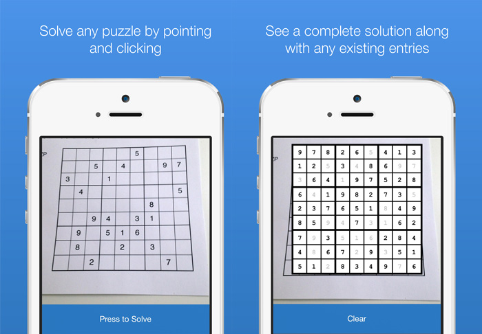
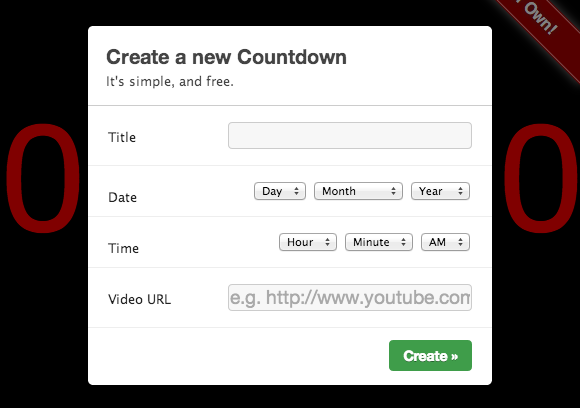
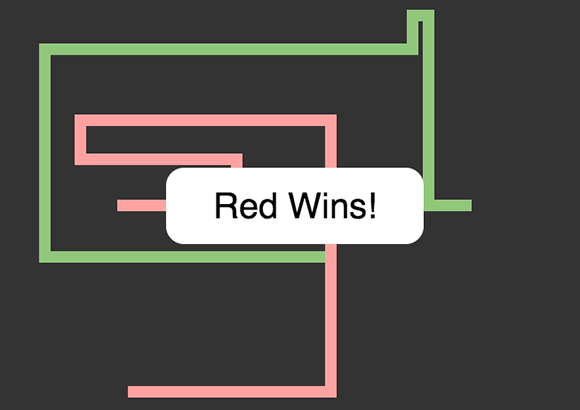



Some of the things I've made over the years are in a usable state and still online. You can find them here!

## [Sudoku Solver](https://itunes.apple.com/US/app/id963980466?mt=8)

Solvr is an iOS app written in Objective-C (with some help from OpenCV/Tesseract) that uses the device's camera and [Norvig's](http://norvig.com/sudoku.html) constraint propogation approach to solve any sudoku at the push of a button.

## [Countdown](http://chrislewis.com.au/Countdown)
Simple countdown timer, written in Javascript. Stores state in the URL. Option to play a specific youtube video at the end of the countdown.

## [jsTron](http://chrislewis.com.au/jsTron)
An early experiment of mine with the HTML Canvas by writing a Tron clone. I was also interested to see how much the code could be compressed so the project also contains a Python that inlines and compresses associated JS/CSS files as part of the build process. Another interesting strategy (which is still on my todo list) is to try a [genetic approach to CSS compression](http://friggeri.net/blog/a-genetic-approach-to-css-compression/).

